## 📊 Database ERD

```mermaid
erDiagram
    CUSTOMERS {
        UUID id PK
        VARCHAR name
        TIMESTAMPTZ created_at
    }

    ACCOUNTS {
        UUID id PK
        UUID customer_id FK
        VARCHAR account_number
        ENUM currency
        VARCHAR status
        BOOLEAN is_house
        NUMERIC balance
        TIMESTAMPTZ created_at
    }

    TRANSFERS {
        UUID id PK
        VARCHAR type
        UUID from_account FK
        UUID to_account FK
        NUMERIC amount
        ENUM currency
        VARCHAR status
        VARCHAR idempotency_key
        TIMESTAMPTZ created_at
    }

    JOURNAL_ENTRIES {
        BIGSERIAL id PK
        UUID transfer_id FK
        UUID account_id FK
        CHAR direction
        NUMERIC amount
        TIMESTAMPTZ created_at
    }

    %% 관계 ì •ì˜
    CUSTOMERS ||--o{ ACCOUNTS : "owns"
    ACCOUNTS ||--o{ TRANSFERS : "source/target"
    TRANSFERS ||--o{ JOURNAL_ENTRIES : "recorded in"
    ACCOUNTS ||--o{ JOURNAL_ENTRIES : "affected in"
```

## 📌 설명
- `CUSTOMERS` ↔ `ACCOUNTS` → 고객은 여러 계좌를 가질 수 있음.
- `ACCOUNTS` ↔ `TRANSFERS` → 하나의 계좌가 송금의 출발/도착 계좌가 될 수 있음.
- `TRANSFERS` ↔ `JOURNAL_ENTRIES` → 이체 기록은 복식부기로 여러 분개를 남김.
- `ACCOUNTS` ↔ `JOURNAL_ENTRIES` → 각 분개는 특정 계좌에 영향을 줌.