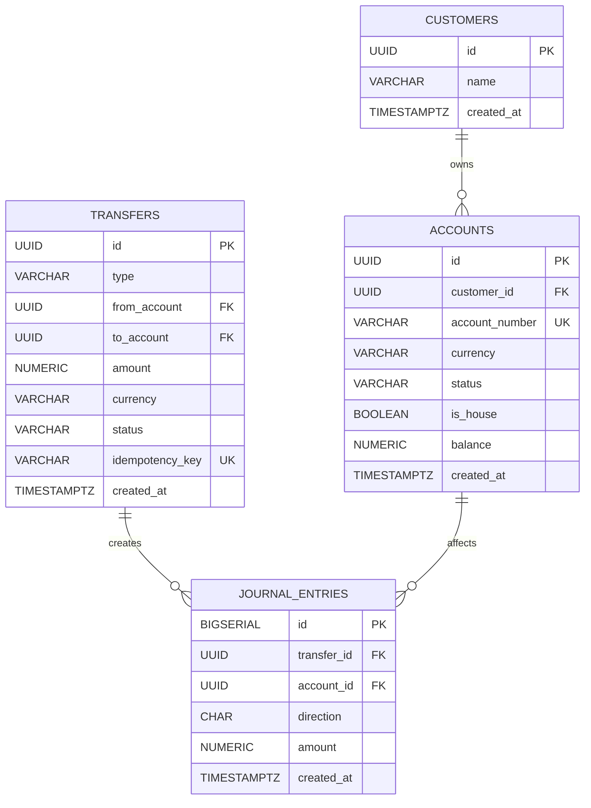

# Database Schema

현재 스키마는 `customers`, `accounts`, `transfers`, `journal_entries` 네 개의 핵심 테이블로 구성됩니다.

## ERD

```mermaid
erDiagram
    CUSTOMERS {
        UUID id PK
        VARCHAR name
        TIMESTAMPTZ created_at
    }

    ACCOUNTS {
        UUID id PK
        UUID customer_id FK
        VARCHAR account_number UK
        VARCHAR currency
        VARCHAR status
        BOOLEAN is_house
        NUMERIC balance
        TIMESTAMPTZ created_at
    }

    TRANSFERS {
        UUID id PK
        VARCHAR type
        UUID from_account FK
        UUID to_account FK
        NUMERIC amount
        VARCHAR currency
        VARCHAR status
        VARCHAR idempotency_key UK
        TIMESTAMPTZ created_at
    }

    JOURNAL_ENTRIES {
        BIGSERIAL id PK
        UUID transfer_id FK
        UUID account_id FK
        CHAR direction
        NUMERIC amount
        TIMESTAMPTZ created_at
    }

    CUSTOMERS ||--o{ ACCOUNTS : owns
    TRANSFERS ||--o{ JOURNAL_ENTRIES : creates
    ACCOUNTS ||--o{ JOURNAL_ENTRIES : affects
```

## 테이블 설명

### `customers`

- 고객 기본 정보
- 한 명의 고객은 여러 계좌를 가질 수 있습니다

### `accounts`

- 계좌번호, 상태, 통화, 잔액 보관
- `account_number`는 `UNIQUE`
- `status`는 `ACTIVE`, `FROZEN`, `CLOSED`만 허용
- `is_house = true`인 계좌는 내부 정산 계좌로 사용

### `transfers`

- 입금, 출금, 계좌이체 거래 자체를 표현
- `type`은 `DEPOSIT`, `WITHDRAW`, `ACCOUNT_TRANSFER`
- `status`는 `PENDING`, `SUCCEEDED`, `FAILED`
- `idempotency_key`는 `UNIQUE`

### `journal_entries`

- 거래별 차변/대변 원장 기록
- `direction`은 `D`, `C`
- 각 거래는 최소 2개의 원장 row를 생성

## 현재 무결성 포인트

- `transfers.idempotency_key UNIQUE`
  - 중복 요청 차단의 DB 최종 방어선
- `amount > 0`
  - 거래 및 원장 금액 음수 방지
- FK 제약
  - 존재하지 않는 계좌/거래 참조 방지
- 상태값 `CHECK`
  - 잘못된 거래 상태 저장 방지

## 구현과의 연결

- 출금/이체 시 `accounts` row는 `PESSIMISTIC_WRITE`로 잠급니다.
- 중복 거래 생성은 `transfers.idempotency_key`와 `ON CONFLICT DO NOTHING`으로 차단합니다.
- 잔액 정합성은 `accounts.balance`와 `journal_entries`를 함께 확인하는 방식으로 검증할 수 있습니다.

## 참고

- 실제 DDL: [V1__init.sql](../main/resources/db/migration/V1__init.sql)
- 동시성 검증 결과: [result.md](../../result.md)
